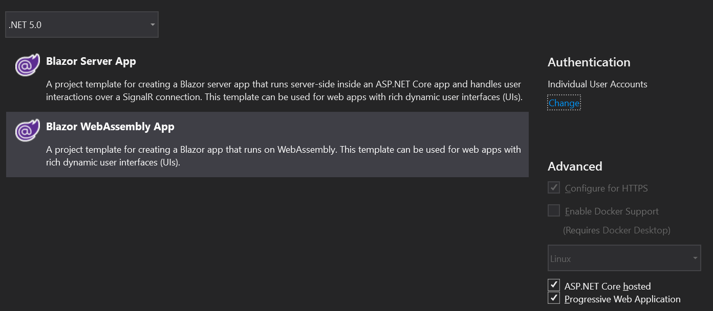

# Multiple Blazor Apps with Authentication

I spent few hours trying to figure out how to add authentication using two Blazor WASM apps. This is a minimal sample of the working solution.

[Demo app](https://blazor-multi-apps.azurewebsites.net/) on azure. 

There is also branch (master-two-slashed-apps) with the (easier) solution for /firstapp and /second app. 

The master branch has naked app (/) and /second app.

## What is it good for?

When you separate the apps, your users could face much smaller payloads (the admin section is in another app).

## Available resources

There are multiple tutorials and repos about multiple Blazor WASM apps that run under the same ASP.NET core hosted app: 

- [Oficial documentation](https://docs.microsoft.com/en-us/aspnet/core/blazor/host-and-deploy/webassembly?view=aspnetcore-5.0#hosted-deployment-with-multiple-blazor-webassembly-apps).
- Hydra app. [Demo](https://cec-blazor-examples.azurewebsites.net/). [GitHub](https://github.com/ShaunCurtis/CEC.Blazor.Examples). [CodeProject](https://www.codeproject.com/Articles/5287009/Blazor-Hydra-Hosting-Multiple-Blazor-SPAs-on-a-sin).
- [Demo App](https://github.com/javiercn/BlazorMultipleApps) from [Javier Calvarro Nelson](https://github.com/javiercn).

None of these tutorials describes how to use authentication. 

## How to add authentication 

- I used the default Visual Studio template for Blazor WASM ASP.NET core Hosted, with enabled Authentication:
.
- Add second project (Client2 in this case). Use the same template, with individual user accounts. Add a reference to the shared project. Also add reference to server project.
- Follow the instructions from [docs](https://docs.microsoft.com/en-us/aspnet/core/blazor/host-and-deploy/webassembly?view=aspnetcore-5.0#hosted-deployment-with-multiple-blazor-webassembly-apps). With some changes:
- In `index.html` (for both client projects) edit `base` tag to`<base href="/FirstApp/" />` and  `<base href="/SecondApp/" />`
- Edit `Startup.cs`, add some configuration (like `UseIdentityServer()`, etc..)
- Edit `Program.cs` of `Client2`. It should look the same as in the first project. 

    ```csharp
    public class Program
        {
            public static async Task Main(string[] args)
            {
                var builder = WebAssemblyHostBuilder.CreateDefault(args);
                builder.RootComponents.Add<App>("#app");

                builder.Services.AddHttpClient("MultipleBlazorAppsWithAuth.ServerAPI", client => client.BaseAddress = new Uri(builder.HostEnvironment.BaseAddress))
                    .AddHttpMessageHandler<BaseAddressAuthorizationMessageHandler>();

                // Supply HttpClient instances that include access tokens when making requests to the server project
                builder.Services.AddScoped(sp => sp.GetRequiredService<IHttpClientFactory>().CreateClient("MultipleBlazorAppsWithAuth.ServerAPI"));

                builder.Services.AddApiAuthorization();

                await builder.Build().RunAsync();
            }
        }
    ```

  - Don't forget to add `Extensions.Http` package in `SecondClient`:

    ```xml
    <PackageReference Include="Microsoft.Extensions.Http" Version="5.0.0" />
    ```

- In `OidcConfigurationController.cs` (server project) edit `HttpGet` attributes, add following:

    ```csharp
    [HttpGet("_configuration/{clientId}")]
    [HttpGet("FirstApp/_configuration/{clientId}")]
    [HttpGet("SecondApp/_configuration/{clientId}")]
    public IActionResult GetClientRequestParameters([FromRoute] string clientId)
    {
    ```

- Add client in `appsettings.json`. IdentityServer section should look like this: 

    ```json
    "IdentityServer": {
        "Clients": {
        "MultipleBlazorAppsWithAuth.Client": {
            "Profile": "IdentityServerSPA"
        },
        "MultipleBlazorAppsWithAuth.Client2": {
            "Profile": "IdentityServerSPA"
        }
        }
    }
    ```
- Edit service-worker.published.js (see below)

## Issues I was facing

- `Unhandled exception rendering component: Could not find 'AuthenticationService.init'`
- `Could not load settings from '_configuration/BlazorApp1.Client'`
- 404 (when I forgot to reference the project)
- and many more...

### The great azure issue

There is an issue with HTTPS and Azure. [SO](https://stackoverflow.com/questions/66614745/multiple-blazor-apps-same-hosting-redirecting-from-the-first-app-to-the-second) question.

#### Solution with service-worker.published.js

There were no calls to server. Even with forced reload.
This seems like a solution: Add this line to `service-worker.published.js` 

```javascript
   && !event.request.url.includes('/secondapp');
```  

It becomes:

```javascript
async function onFetch(event) {
    let cachedResponse = null;
    if (event.request.method === 'GET') {
        // For all navigation requests, try to serve index.html from cache
        // If you need some URLs to be server-rendered, edit the following check to exclude those URLs
        const shouldServeIndexHtml = event.request.mode === 'navigate'
            && !event.request.url.includes('/connect/')
            && !event.request.url.includes('/Identity/')
            && !event.request.url.includes('/secondapp');

        const request = shouldServeIndexHtml ? 'index.html' : event.request;
        const cache = await caches.open(cacheName);
        cachedResponse = await cache.match(request);
    }

    return cachedResponse || fetch(event.request);
}
``` 

[GH issue](https://github.com/dotnet/aspnetcore/issues/25430#issuecomment-711151687) that helped me with this.

#### [not working] Favicon solution 

**Probably not correct (uff).** 

That issue is so weird. The only thing that seems to work is to change the request path from favicon (??).
I guess it has something to do with auth request and redirecting them back to the caller (which is the first client)
